..
      Except where otherwise noted, this document is licensed under Creative
      Commons Attribution 3.0 License.  You can view the license at:

          https://creativecommons.org/licenses/by/3.0/

.. _architecture:

===================
System Architecture
===================

This page presents the current technical Architecture of the Watcher system.

.. _architecture_overview:

Overview
========

Below you will find a diagram, showing the main components of Watcher:

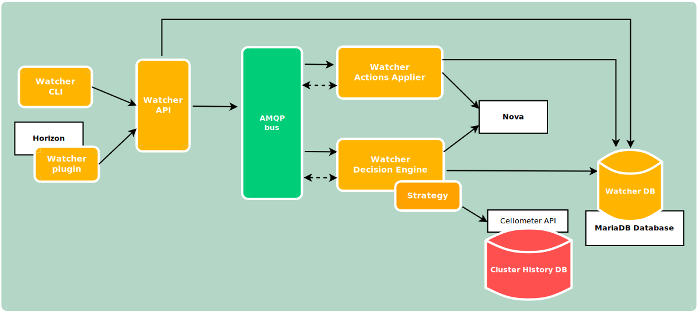

.. _components_definition:

Components
==========

.. _amqp_bus_definition:

AMQP Bus
--------

The AMQP message bus handles internal asynchronous communications between the
different Watcher components.

.. _cluster_datasource_definition:

Datasource
----------

This component stores the metrics related to the cluster.

It can potentially rely on any appropriate storage system (InfluxDB, OpenTSDB,
MongoDB,...) but will probably be more performant when using
`Time Series Databases <https://en.wikipedia.org/wiki/Time_series_database>`_
which are optimized for handling time series data, which are arrays of numbers
indexed by time (a datetime or a datetime range).

.. _archi_watcher_api_definition:

Watcher API
-----------

This component implements the REST API provided by the Watcher system to the
external world.

It enables the :ref:`Administrator <administrator_definition>` of a
:ref:`Cluster <cluster_definition>` to control and monitor the Watcher system
via any interaction mechanism connected to this API:

-   :ref:`CLI <archi_watcher_cli_definition>`
-   Horizon plugin
-   Python SDK

You can also read the detailed description of `Watcher API`_.

.. _archi_watcher_applier_definition:

Watcher Applier
---------------

This component is in charge of executing the
:ref:`Action Plan <action_plan_definition>` built by the
:ref:`Watcher Decision Engine <watcher_decision_engine_definition>`.
Taskflow is the default workflow engine for Watcher.

It connects to the :ref:`message bus <amqp_bus_definition>` and launches the
:ref:`Action Plan <action_plan_definition>` whenever a triggering message is
received on a dedicated AMQP queue.

The triggering message contains the Action Plan UUID.

It then gets the detailed information about the
:ref:`Action Plan <action_plan_definition>` from the
:ref:`Watcher Database <watcher_database_definition>` which contains the list
of :ref:`Actions <action_definition>` to launch.

It then loops on each :ref:`Action <action_definition>`, gets the associated
class and calls the execute() method of this class.
Most of the time, this method will first request a token to the Keystone API
and if it is allowed, sends a request to the REST API of the OpenStack service
which handles this kind of :ref:`atomic Action <action_definition>`.

Note that as soon as :ref:`Watcher Applier <watcher_applier_definition>` starts
handling a given :ref:`Action <action_definition>` from the list, a
notification message is sent on the :ref:`message bus <amqp_bus_definition>`
indicating that the state of the action has changed to **ONGOING**.

If the :ref:`Action <action_definition>` is successful,
the :ref:`Watcher Applier <watcher_applier_definition>` sends a notification
message on :ref:`the bus <amqp_bus_definition>` informing the other components
of this.

If the :ref:`Action <action_definition>` fails, the
:ref:`Watcher Applier <watcher_applier_definition>` tries to rollback to the
previous state of the :ref:`Managed resource <managed_resource_definition>`
(i.e. before the command was sent to the underlying OpenStack service).

In Stein, added a new config option 'action_execution_rule' which is a
dict type. Its key field is strategy name and the value is 'ALWAYS' or 'ANY'.
'ALWAYS' means the callback function returns True as usual.
'ANY' means the return depends on the result of previous action execution.
The callback returns True if previous action gets failed, and the engine
continues to run the next action. If previous action executes success,
the callback returns False then the next action will be ignored.
For strategies that aren't in 'action_execution_rule', the callback always
returns True.
Please add the next section in the watcher.conf file
if your strategy needs this feature.

::

    [watcher_workflow_engines.taskflow]
    action_execution_rule = {'your strategy name': 'ANY'}

.. _archi_watcher_cli_definition:

Watcher CLI
-----------

The watcher command-line interface (CLI) can be used to interact with the
Watcher system in order to control it or to know its current status.

Please, read `the detailed documentation about Watcher CLI
<https://docs.openstack.org/python-watcherclient/latest/cli/>`_.

.. _archi_watcher_dashboard_definition:

Watcher Dashboard
-----------------

The Watcher Dashboard can be used to interact with the Watcher system through
Horizon in order to control it or to know its current status.

Please, read `the detailed documentation about Watcher Dashboard
<https://docs.openstack.org/watcher-dashboard/latest>`_.

.. _archi_watcher_database_definition:

Watcher Database
----------------

This database stores all the Watcher domain objects which can be requested
by the :ref:`Watcher API <archi_watcher_api_definition>` or the
:ref:`Watcher CLI <archi_watcher_cli_definition>`:

-  :ref:`Goals <goal_definition>`
-  :ref:`Strategies <strategy_definition>`
-  :ref:`Audit templates <audit_template_definition>`
-  :ref:`Audits <audit_definition>`
-  :ref:`Action plans <action_plan_definition>`
-  :ref:`Efficacy indicators <efficacy_indicator_definition>` via the Action
   Plan API.
-  :ref:`Actions <action_definition>`

The Watcher domain being here "*optimization of some resources provided by an
OpenStack system*".

.. _archi_watcher_decision_engine_definition:

Watcher Decision Engine
-----------------------

This component is responsible for computing a set of potential optimization
:ref:`Actions <action_definition>` in order to fulfill
the :ref:`Goal <goal_definition>` of an :ref:`Audit <audit_definition>`.

It first reads the parameters of the :ref:`Audit <audit_definition>` to know
the :ref:`Goal <goal_definition>` to achieve.

Unless specified, it then selects the most appropriate :ref:`strategy
<strategy_definition>` from the list of available strategies achieving this
goal.

The :ref:`Strategy <strategy_definition>` is then dynamically loaded (via
`stevedore <https://docs.openstack.org/stevedore/latest>`_). The
:ref:`Watcher Decision Engine <watcher_decision_engine_definition>` executes
the strategy.

In order to compute the potential :ref:`Solution <solution_definition>` for the
Audit, the :ref:`Strategy <strategy_definition>` relies on different sets of
data:

- :ref:`Cluster data models <cluster_data_model_definition>` that are
  periodically synchronized through pluggable cluster data model collectors.
  These models contain the current state of various
  :ref:`Managed resources <managed_resource_definition>` (e.g., the data stored
  in the Nova database). These models gives a strategy the ability to reason on
  the current state of a given :ref:`cluster <cluster_definition>`.
- The data stored in the :ref:`Cluster Datasource
  <cluster_datasource_definition>` which provides information about the past of
  the :ref:`Cluster <cluster_definition>`.

Here below is a sequence diagram showing how the Decision Engine builds and
maintains the :ref:`cluster data models <cluster_data_model_definition>` that
are used by the strategies.

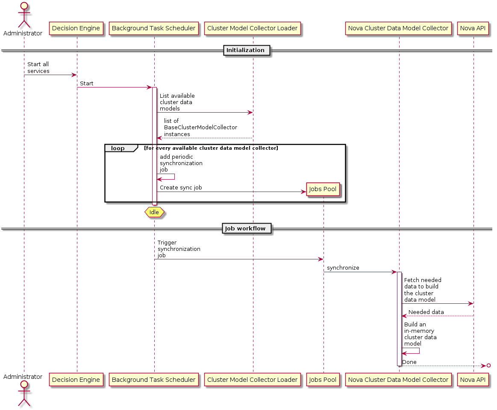

The execution of a strategy then yields a solution composed of a set of
:ref:`Actions <action_definition>` as well as a set of :ref:`efficacy
indicators <efficacy_indicator_definition>`.

These :ref:`Actions <action_definition>` are scheduled in time by the
:ref:`Watcher Planner <watcher_planner_definition>` (i.e., it generates an
:ref:`Action Plan <action_plan_definition>`).

.. _data_model:

Data model
==========

The following diagram shows the data model of Watcher, especially the
functional dependency of objects from the actors (Admin, Customer) point of
view (Goals, Audits, Action Plans, ...):

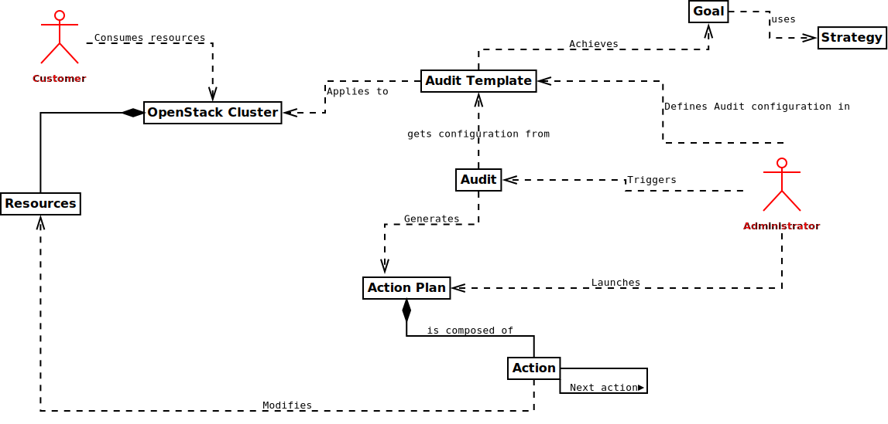

Here below is a diagram representing the main objects in Watcher from a
database perspective:

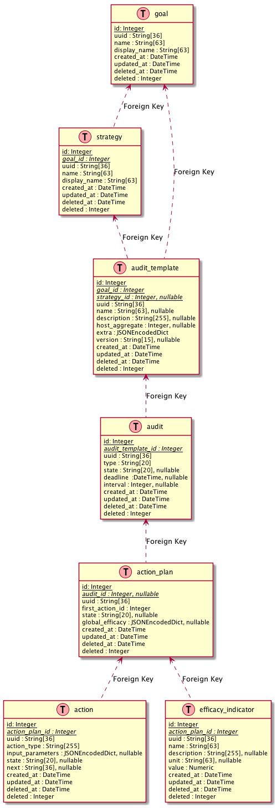

.. _sequence_diagrams:

Sequence diagrams
=================

The following paragraph shows the messages exchanged between the different
components of Watcher for the most often used scenarios.

.. _sequence_diagrams_create_audit_template:

Create a new Audit Template
---------------------------

The :ref:`Administrator <administrator_definition>` first creates an
:ref:`Audit template <audit_template_definition>` providing at least the
following parameters:

-   A name
-   A goal to achieve
-   An optional strategy

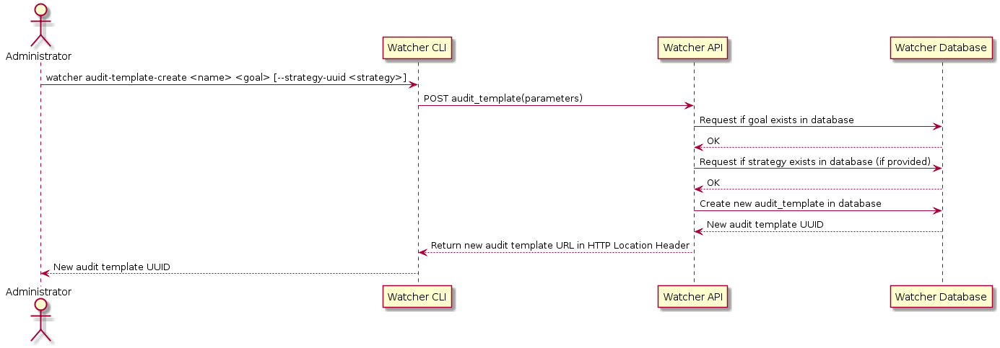

The `Watcher API`_  makes sure that both the specified goal (mandatory) and
its associated strategy (optional) are registered inside the :ref:`Watcher
Database <watcher_database_definition>` before storing a new audit template in
the :ref:`Watcher Database <watcher_database_definition>`.

.. _sequence_diagrams_create_and_launch_audit:

Create and launch a new Audit
-----------------------------

The :ref:`Administrator <administrator_definition>` can then launch a new
:ref:`Audit <audit_definition>` by providing at least the unique UUID of the
previously created :ref:`Audit template <audit_template_definition>`:

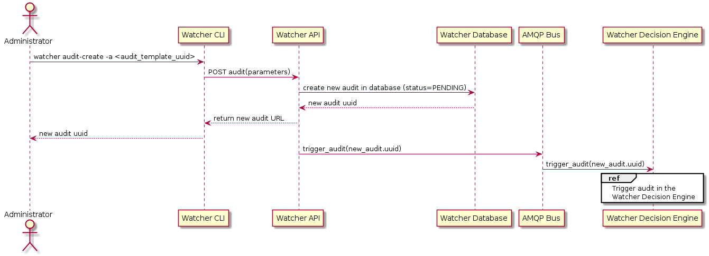

The :ref:`Administrator <administrator_definition>` also can specify type of
Audit and interval (in case of CONTINUOUS type). There is two types of Audit:
ONESHOT and CONTINUOUS. Oneshot Audit is launched once and if it succeeded
executed new action plan list will be provided. Continuous Audit creates
action plans with specified interval (in seconds); if action plan
has been created, all previous action plans get CANCELLED state.

A message is sent on the :ref:`AMQP bus <amqp_bus_definition>` which triggers
the Audit in the
:ref:`Watcher Decision Engine <watcher_decision_engine_definition>`:

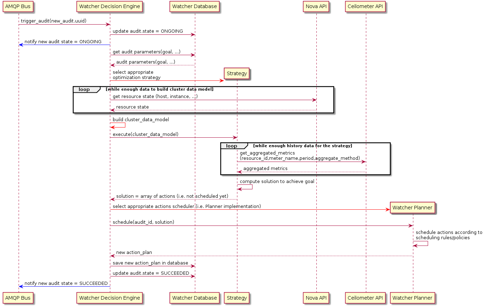

The :ref:`Watcher Decision Engine <watcher_decision_engine_definition>` reads
the Audit parameters from the
:ref:`Watcher Database <watcher_database_definition>`. It instantiates the
appropriate :ref:`strategy <strategy_definition>` (using entry points)
given both the :ref:`goal <goal_definition>` and the strategy associated to the
parent :ref:`audit template <audit_template_definition>` of the :ref:`audit
<audit_definition>`. If no strategy is associated to the audit template, the
strategy is dynamically selected by the Decision Engine.

The :ref:`Watcher Decision Engine <watcher_decision_engine_definition>` also
builds the :ref:`Cluster Data Model <cluster_data_model_definition>`. This
data model is needed by the :ref:`Strategy <strategy_definition>` to know the
current state and topology of the audited
:ref:`OpenStack cluster <cluster_definition>`.

The :ref:`Watcher Decision Engine <watcher_decision_engine_definition>` calls
the **execute()** method of the instantiated
:ref:`Strategy <strategy_definition>` and provides the data model as an input
parameter. This method computes a :ref:`Solution <strategy_definition>` to
achieve the goal and returns it to the
:ref:`Decision Engine <watcher_decision_engine_definition>`. At this point,
actions are not scheduled yet.

The :ref:`Watcher Decision Engine <watcher_decision_engine_definition>`
dynamically loads the :ref:`Watcher Planner <watcher_planner_definition>`
implementation which is configured in Watcher (via entry points) and calls the
**schedule()** method of this class with the solution as an input parameter.
This method finds an appropriate scheduling of
:ref:`Actions <action_definition>` taking into account some scheduling rules
(such as priorities between actions).
It generates a new :ref:`Action Plan <action_plan_definition>` with status
**RECOMMENDED** and saves it into the :ref:`Watcher Database
<watcher_database_definition>`. The saved action plan is now a scheduled flow
of actions to which a global efficacy is associated alongside a number of
:ref:`Efficacy Indicators <efficacy_indicator_definition>` as specified by the
related :ref:`goal <goal_definition>`.

If every step executed successfully, the
:ref:`Watcher Decision Engine <watcher_decision_engine_definition>` updates
the current status of the Audit to **SUCCEEDED** in the
:ref:`Watcher Database <watcher_database_definition>` and sends a notification
on the bus to inform other components that the :ref:`Audit <audit_definition>`
was successful.

This internal workflow the Decision Engine follows to conduct an audit can be
seen in the sequence diagram here below:

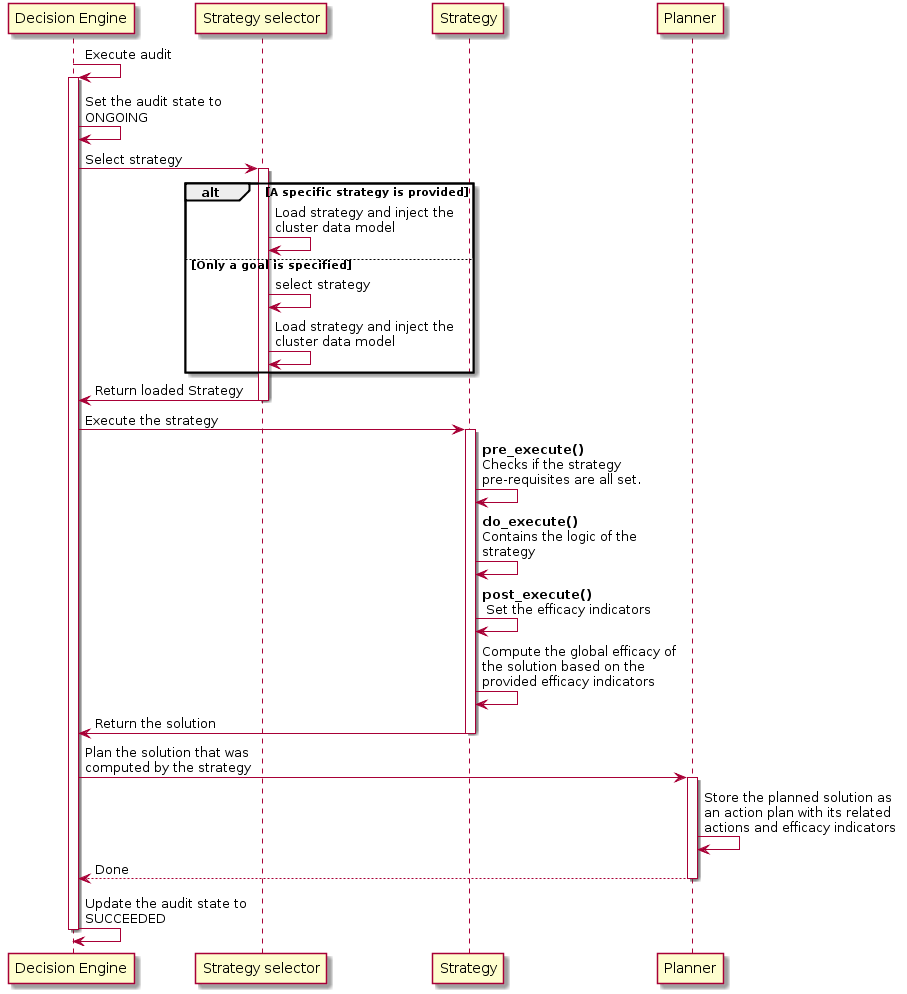

.. _sequence_diagrams_launch_action_plan:

Launch Action Plan
------------------

The :ref:`Administrator <administrator_definition>` can then launch the
recommended :ref:`Action Plan <action_plan_definition>`:

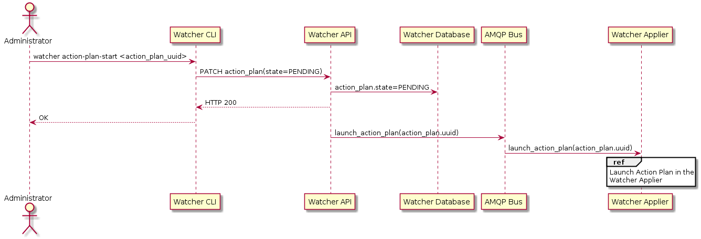

A message is sent on the :ref:`AMQP bus <amqp_bus_definition>` which triggers
the :ref:`Action Plan <action_plan_definition>` in the
:ref:`Watcher Applier <watcher_applier_definition>`:

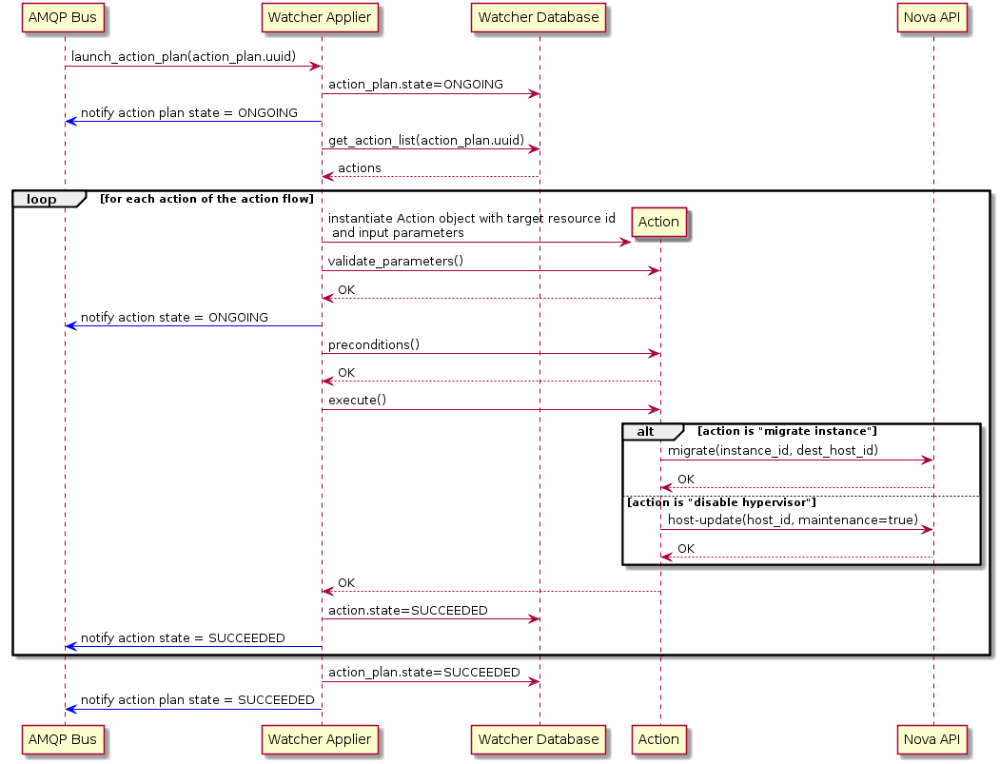

The :ref:`Watcher Applier <watcher_applier_definition>` will get the
description of the flow of :ref:`Actions <action_definition>` from the
:ref:`Watcher Database <watcher_database_definition>` and for each
:ref:`Action <action_definition>` it will instantiate a corresponding
:ref:`Action <action_definition>` handler python class.

The :ref:`Watcher Applier <watcher_applier_definition>` will then call the
following methods of the :ref:`Action <action_definition>` handler:

-   **validate_parameters()**: this method will make sure that all the
    provided input parameters are valid:

    -   If all parameters are valid, the Watcher Applier moves on to the next
        step.
    -   If it is not, an error is raised and the action is not executed. A
        notification is sent on the bus informing other components of the
        failure.

-   **preconditions()**: this method will make sure that all conditions are met
    before executing the action (for example, it makes sure that an instance
    still exists before trying to migrate it).
-   **execute()**: this method is what triggers real commands on other
    OpenStack services (such as Nova, ...) in order to change target resource
    state. If the action is successfully executed, a notification message is
    sent on the bus indicating that the new state of the action is
    **SUCCEEDED**.

If every action of the action flow has been executed successfully, a
notification is sent on the bus to indicate that the whole
:ref:`Action Plan <action_plan_definition>` has **SUCCEEDED**.

.. _state_machine_diagrams:

State Machine diagrams
======================

.. _audit_state_machine:

Audit State Machine
-------------------

An :ref:`Audit <audit_definition>` has a life-cycle and its current state may
be one of the following:

-  **PENDING** : a request for an :ref:`Audit <audit_definition>` has been
   submitted (either manually by the
   :ref:`Administrator <administrator_definition>` or automatically via some
   event handling mechanism) and is in the queue for being processed by the
   :ref:`Watcher Decision Engine <watcher_decision_engine_definition>`
-  **ONGOING** : the :ref:`Audit <audit_definition>` is currently being
   processed by the
   :ref:`Watcher Decision Engine <watcher_decision_engine_definition>`
-  **SUCCEEDED** : the :ref:`Audit <audit_definition>` has been executed
   successfully and at least one solution was found
-  **FAILED** : an error occurred while executing the
   :ref:`Audit <audit_definition>`
-  **DELETED** : the :ref:`Audit <audit_definition>` is still stored in the
   :ref:`Watcher database <watcher_database_definition>` but is not returned
   any more through the Watcher APIs.
-  **CANCELLED** : the :ref:`Audit <audit_definition>` was in **PENDING** or
   **ONGOING** state and was cancelled by the
   :ref:`Administrator <administrator_definition>`
-  **SUSPENDED** : the :ref:`Audit <audit_definition>` was in **ONGOING**
   state and was suspended by the
   :ref:`Administrator <administrator_definition>`

The following diagram shows the different possible states of an
:ref:`Audit <audit_definition>` and what event makes the state change to a new
value:

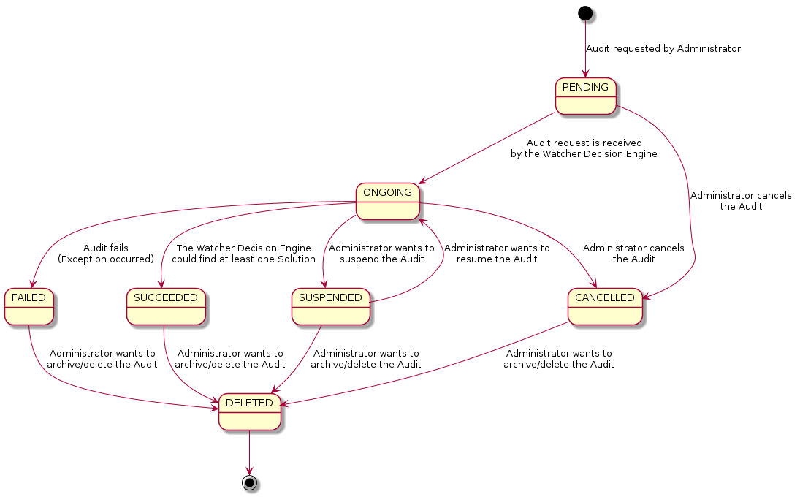

.. _action_plan_state_machine:

Action Plan State Machine
-------------------------

An :ref:`Action Plan <action_plan_definition>` has a life-cycle and its current
state may be one of the following:

-  **RECOMMENDED** : the :ref:`Action Plan <action_plan_definition>` is waiting
   for a validation from the :ref:`Administrator <administrator_definition>`
-  **PENDING** : a request for an :ref:`Action Plan <action_plan_definition>`
   has been submitted (due to an
   :ref:`Administrator <administrator_definition>` executing an
   :ref:`Audit <audit_definition>`) and is in the queue for
   being processed by the :ref:`Watcher Applier <watcher_applier_definition>`
-  **ONGOING** : the :ref:`Action Plan <action_plan_definition>` is currently
   being processed by the :ref:`Watcher Applier <watcher_applier_definition>`
-  **SUCCEEDED** : the :ref:`Action Plan <action_plan_definition>` has been
   executed successfully (i.e. all :ref:`Actions <action_definition>` that it
   contains have been executed successfully)
-  **FAILED** : an error occurred while executing the
   :ref:`Action Plan <action_plan_definition>`
-  **DELETED** : the :ref:`Action Plan <action_plan_definition>` is still
   stored in the :ref:`Watcher database <watcher_database_definition>` but is
   not returned any more through the Watcher APIs.
-  **CANCELLED** : the :ref:`Action Plan <action_plan_definition>` was in
   **RECOMMENDED**, **PENDING** or **ONGOING** state and was cancelled by the
   :ref:`Administrator <administrator_definition>`
-  **SUPERSEDED** : the :ref:`Action Plan <action_plan_definition>` was in
   RECOMMENDED state and was automatically superseded by Watcher, due to an
   expiration delay or an update of the
   :ref:`Cluster data model <cluster_data_model_definition>`

The following diagram shows the different possible states of an
:ref:`Action Plan <action_plan_definition>` and what event makes the state
change to a new value:

.. image:: ./images/action_plan_state_machine.png
   :width: 100%

.. _Watcher API: https://docs.openstack.org/api-ref/resource-optimization/
