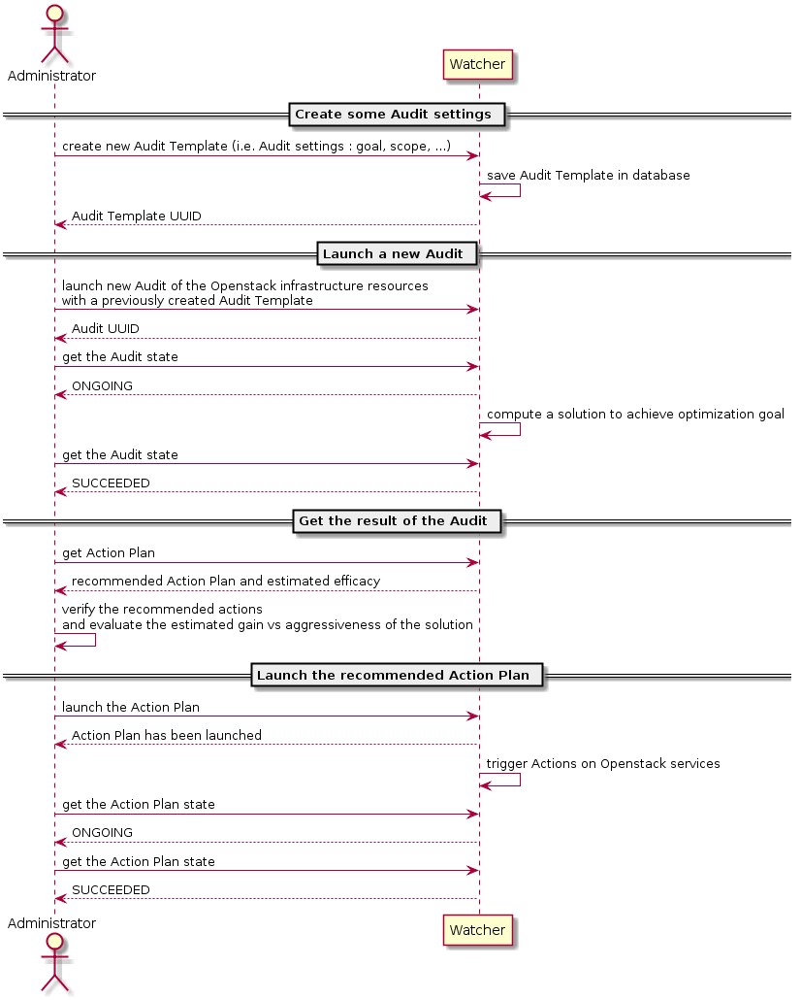

..
      Except where otherwise noted, this document is licensed under Creative
      Commons Attribution 3.0 License.  You can view the license at:

          https://creativecommons.org/licenses/by/3.0/

==================
Watcher User Guide
==================

See the
`architecture page <https://docs.openstack.org/watcher/latest/architecture.html>`_
for an architectural overview of the different components of Watcher and how
they fit together.

In this guide we're going to take you through the fundamentals of using
Watcher.

The following diagram shows the main interactions between the
:ref:`Administrator <administrator_definition>` and the Watcher system:

Getting started with Watcher
----------------------------
This guide assumes you have a working installation of Watcher. If you get
"*watcher: command not found*" you may have to verify your installation.
Please refer to the `installation guide`_.
In order to use Watcher, you have to configure your credentials suitable for
watcher command-line tools.

You can interact with Watcher either by using our dedicated `Watcher CLI`_
named ``watcher``, or by using the `OpenStack CLI`_ ``openstack``.

If you want to deploy Watcher in Horizon, please refer to the `Watcher Horizon
plugin installation guide`_.

.. note::

   Notice, that in this guide we'll use `OpenStack CLI`_ as major interface.
   Nevertheless, you can use `Watcher CLI`_ in the same way. It can be
   achieved by replacing

   .. code:: bash

     $ openstack optimize ...

   with

   .. code:: bash

     $ watcher ...

.. _`installation guide`: https://docs.openstack.org/watcher/latest/install/
.. _`Watcher Horizon plugin installation guide`: https://docs.openstack.org/watcher-dashboard/latest/install/installation.html
.. _`OpenStack CLI`: https://docs.openstack.org/python-openstackclient/latest/cli/man/openstack.html
.. _`Watcher CLI`: https://docs.openstack.org/python-watcherclient/latest/cli/index.html

Watcher CLI Command
-------------------
We can see all of the commands available with Watcher CLI by running the
watcher binary without options.

.. code:: bash

  $ openstack help optimize

Running an audit of the cluster
-------------------------------

First, you need to find the :ref:`goal <goal_definition>` you want to achieve:

.. code:: bash

  $ openstack optimize goal list

.. note::

    If you get "*You must provide a username via either --os-username or via
    env[OS_USERNAME]*" you may have to verify your credentials.

Then, you can create an :ref:`audit template <audit_template_definition>`.
An :ref:`audit template <audit_template_definition>` defines an optimization
:ref:`goal <goal_definition>` to achieve (i.e. the settings of your audit).

.. code:: bash

  $ openstack optimize audittemplate create my_first_audit_template <your_goal>

Although optional, you may want to actually set a specific strategy for your
audit template. If so, you may can search of its UUID or name using the
following command:

.. code:: bash

  $ openstack optimize strategy list --goal <your_goal_uuid_or_name>

You can use the following command to check strategy details including which
parameters of which format it supports:

.. code:: bash

  $ openstack optimize strategy show <your_strategy>

The command to create your audit template would then be:

.. code:: bash

  $ openstack optimize audittemplate create my_first_audit_template <your_goal> \
    --strategy <your_strategy>

Then, you can create an audit. An audit is a request for optimizing your
cluster depending on the specified :ref:`goal <goal_definition>`.

You can launch an audit on your cluster by referencing the
:ref:`audit template <audit_template_definition>` (i.e. the settings of your
audit) that you want to use.

- Get the :ref:`audit template <audit_template_definition>` UUID or name:

.. code:: bash

  $ openstack optimize audittemplate list

- Start an audit based on this :ref:`audit template
  <audit_template_definition>` settings:

.. code:: bash

  $ openstack optimize audit create -a <your_audit_template>

If your_audit_template was created by --strategy <your_strategy>, and it
defines some parameters (command ``watcher strategy show`` to check parameters
format), your can append ``-p`` to input required parameters:

.. code:: bash

  $ openstack optimize audit create -a <your_audit_template> \
    -p <your_strategy_para1>=5.5 -p <your_strategy_para2>=hi

Input parameter could cause audit creation failure, when:

- no predefined strategy for audit template
- no parameters spec in predefined strategy
- input parameters don't comply with spec

Watcher service will compute an :ref:`Action Plan <action_plan_definition>`
composed of a list of potential optimization :ref:`actions <action_definition>`
(instance migration, disabling of a compute node, ...) according to the
:ref:`goal <goal_definition>` to achieve.

- Wait until the Watcher audit has produced a new :ref:`action plan
  <action_plan_definition>`, and get it:

.. code:: bash

  $ openstack optimize actionplan list --audit <the_audit_uuid>

- Have a look on the list of optimization :ref:`actions <action_definition>`
  contained in this new :ref:`action plan <action_plan_definition>`:

.. code:: bash

  $ openstack optimize action list --action-plan <the_action_plan_uuid>

Once you have learned how to create an :ref:`Action Plan
<action_plan_definition>`, it's time to go further by applying it to your
cluster:

- Execute the :ref:`action plan <action_plan_definition>`:

.. code:: bash

  $ openstack optimize actionplan start <the_action_plan_uuid>

You can follow the states of the :ref:`actions <action_definition>` by
periodically calling:

.. code:: bash

  $ openstack optimize action list --action-plan <the_action_plan_uuid>

You can also obtain more detailed information about a specific action:

.. code:: bash

  $ openstack optimize action show <the_action_uuid>

